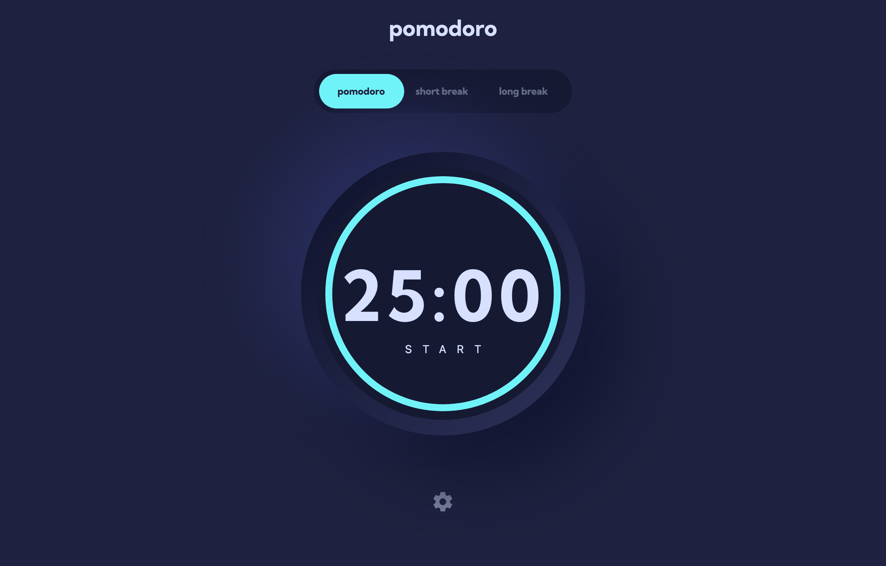

# Frontend Mentor - Pomodoro app solution

This is a solution to the [Pomodoro app challenge on Frontend Mentor](https://www.frontendmentor.io/challenges/pomodoro-app-KBFnycJ6G). Frontend Mentor challenges help you improve your coding skills by building realistic projects.

## Table of contents

- [Frontend Mentor - Pomodoro app solution](#frontend-mentor---pomodoro-app-solution)
  - [Table of contents](#table-of-contents)
  - [Overview](#overview)
    - [The challenge](#the-challenge)
    - [Screenshot](#screenshot)
    - [Links](#links)
  - [My process](#my-process)
    - [Built with](#built-with)
    - [What I learned](#what-i-learned)
    - [Continued development](#continued-development)
    - [Useful resources](#useful-resources)
  - [Author](#author)

## Overview

This is app is a Pomodoro timer that was built with HTML, CSS and JavaScript. It stores the users settings and what session they are currently on using local storage.

### The challenge

Users should be able to:

- Set a pomodoro timer and short & long break timers
- Customize how long each timer runs for
- See a circular progress bar that updates every minute and represents how far through their timer they are
- Customize the appearance of the app with the ability to set preferences for colors and fonts

### Screenshot

### Links

- Solution URL: [Pomodoro App GitHub Repository](https://github.com/rnbrietzke10/pomodoro-app)
- Live Site URL: [Pomodoro App](https://rnbrietzke10.github.io/pomodoro-app/)

## My process

I started with the layout of the timer, then began to work on the functionality of getting the timer running and having the progress circle move with the timer. The next thing I worked on was the settings modal layout. Once the modal was finished I started to plan out the functionality needed for the settings. After I knew what needed to be done I used JavaScript to create the functionality. Once the app was working I went back and separated the setting functionality into it's own file and made changes needed to the styling.

### Built with

- Semantic HTML5 markup
- CSS
- SVG Elements
- Flexbox
- JavaScript

### What I learned

While working on this project I learned a lot about how to work with creating and manipulating SVG elements. It also helped me with practicing breaking up my code and using the DRY principle.

### Continued development

I plan to go back and try to see if there are any more places where I can create functions to reduce the amount of code used.

### Useful resources

- [Circular Progress Bar Using SVG | HTML | CSS | JS](https://youtu.be/f7XUZFexSgo) - This helped me to better understand how to make SVGs and manipulate them.
- [How to Scale SVGs](https://youtu.be/Clv_YhMWoFk) - I was struggling on how to modify the progress circle SVG for mobile devices and when I was researching the topic I found this video. It helped me understand the diffrence between the SVG viewport and viewbox. I learned that the viewport is what you will be able to see and the rest of the SVG will not be seen. This is controlled by setting the height and the width if the viewbox is not specified in the SVG. The viewbox is used to specify where the viewbox will start and the height and width of the viewbox. If the viewbox is specified then you can use the height and width in CSS to scale your SVG

**Note: Delete this note and replace the list above with resources that helped you during the challenge. These could come in handy for anyone viewing your solution or for yourself when you look back on this project in the future.**

## Author

- GitHub - [Rebecca Brietzke](https://github.com/rnbrietzke10)
- Frontend Mentor - [@rnbrietzke10](https://www.frontendmentor.io/profile/rnbrietzke10)
